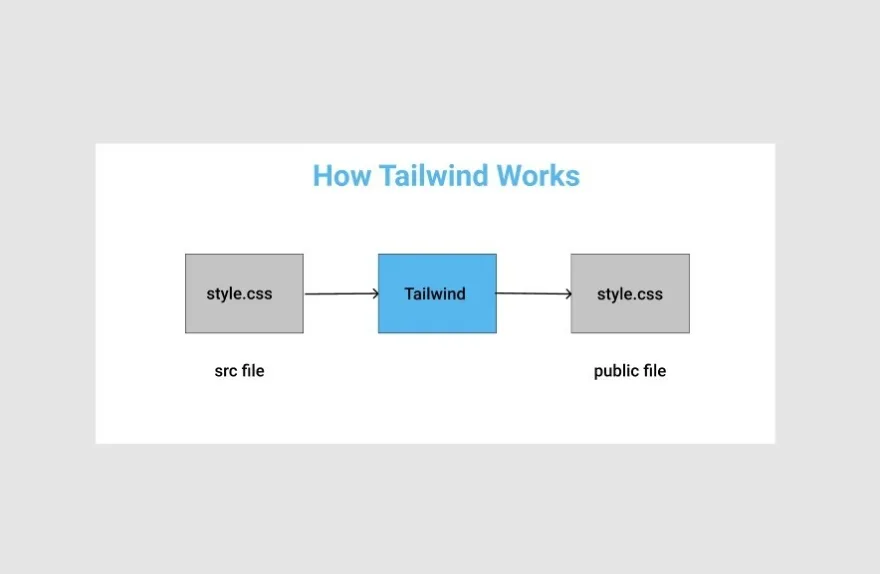

# Tailwind CSS. 

* CSS framework made up of utility classes.

* 
 Much lower-level than Bootstrap, materalize

## You should know... 

* 
 Both HTML and CSS. 

## Using Tailwind CSS

* 
 Install Tailwind using npm (node package manager) 
* 
 You'll need node.js installed on your computer.
  

## How Tailwind Works    

